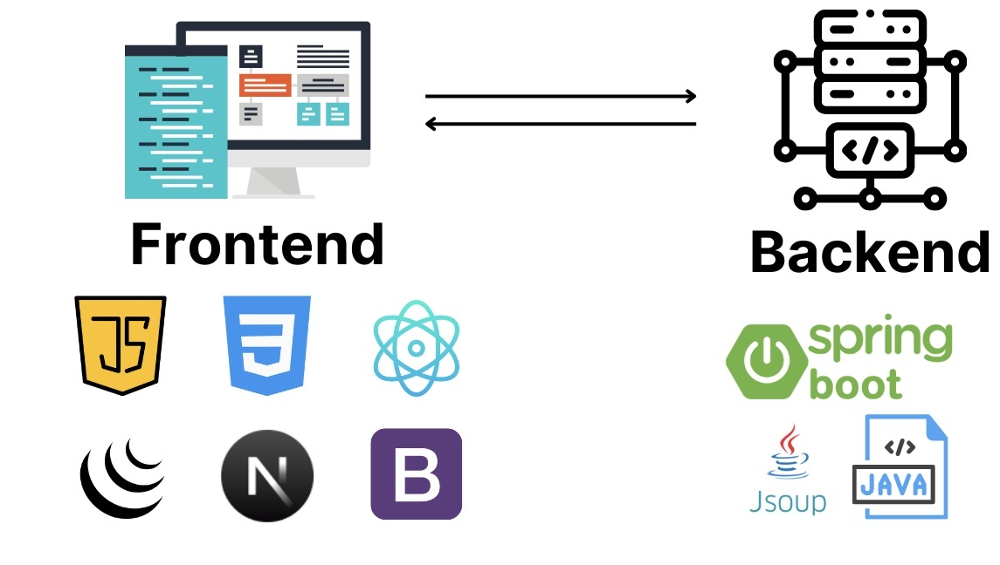

# Ứng dụng hàng đợi để đọc nội dung trang web

## 1. Introduction


Đây là một đồ án môn học thuộc học phần Cấu trúc dữ liệu giải thuật của đại học kinh tế UEH.  
Dự án được lập trình chính bằng ngôn ngữ **Javascript** và **Java**, với các công nghệ được trình bày như hình vẽ.  
---

## 2. Application setup

Để thiết lập dự án, thực hiện các bước sau:

### 2.1. Cài đặt các công cụ cần thiết
1. **Cài đặt npm**  
   Xem chi tiết tại [npm documentation](https://docs.npmjs.com/).
2. **Cài đặt Maven management (mvn)**  
   Xem chi tiết tại [Maven documentation](https://maven.apache.org/).
3. **Thiết lập MongoDB Atlas**  
   Xem chi tiết tại [MongoDB Atlas documentation](https://www.mongodb.com/atlas).

### 2.2. Sao chép và thiết lập dự án
Clone dự án từ GitHub:
```bash
git clone https://github.com/dinhtanloc/Scrawler-Web-data-using-DSA-Algorithm.git
```

Tại thư mục chính của dự án, sử dụng terminal để thiết lập các thư mục con:

#### Frontend
```bash
cd frontend
npm i
npm run dev
```
Frontend sẽ được chạy ở cổng `3000`.

#### Backend
```bash
cd backend
mvn clean install
mvn spring-boot:run
```
Backend sẽ được chạy ở cổng `8080`.

### Ghi chú
- Cần đảm bảo các biến môi trường được thiết lập chính xác.  
- Hãy kiểm tra tài liệu hướng dẫn chi tiết trong các liên kết bên trên nếu gặp vấn đề.


